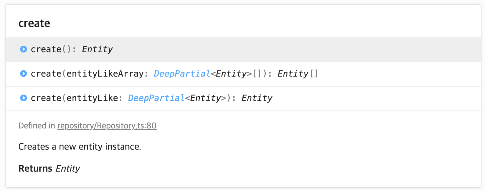

# 201101

## 데이터매퍼 패턴

- 매퍼의 레이어는 개체와 데이터 베이스 사이에 데이터를 이동 시킴.
- 데이터 매퍼를 위한 주요한 이슈는 데이터 베이스 스키마와 독립적으로 포함된 개체 모델을 원할 때이다.

Q. TypeORM 의 create 함수는 어떤 역할을 하는 함수일까? 

```tsx
const MilestoneService = {
  createMilestone: async (milestoneData: createMilestone): Promise<void> => {
    const milestoneRepository: Repository<MilestoneEntity> = getRepository(
      MilestoneEntity
    );
    const milestone: MilestoneEntity = await milestoneRepository.create(
      milestoneData
    );
    await milestoneRepository.save(milestone);
  },
};
```

```tsx
const MilestoneService = {
  createMilestone: async (milestoneData: createMilestone): Promise<void> => {
    const milestoneRepository: Repository<MilestoneEntity> = getRepository(
      MilestoneEntity
    );
    await milestoneRepository.save(milestone);
  },
};
```

```sql
query: START TRANSACTION
query: INSERT INTO `Milestone`(`id`, `title`, `description`, `dueDate`) VALUES (DEFAULT, ?, ?, ?) -- PARAMETERS: ["goss","good","2020-05-05T00:00:00.000Z"]
query: COMMIT
```



## Q. HTTP 메소드 중 PUT 과 PATCH 의 차이?

`PUT` : 자원의 전체 교체, 자원교체 시 모든 필드 필요(만약 전체가 아닌 일부만 전달할 경우,

전달한 필드외 모두 null or 초기값 처리되니 주의!!)

`PATCH` : 자원의 부분 교체, 자원교체시 일부 필드 필요
