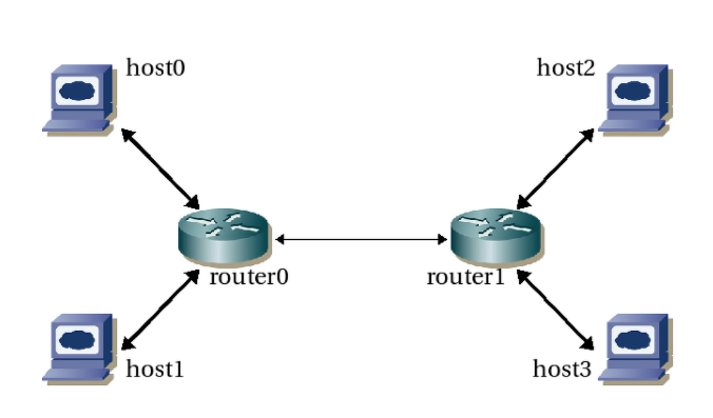

# 201102

## 네트워크 계층

역할 : 

송신 호스트의 네트워크 계층 : 트랜스포트 계층으로부터 세그먼트를 얻어 각 세그먼트를 데이터그램으로 캡슐화하고 인접한 라우터에게 데이터그램을 보낸다. 

수신 호스트의 네트워크 계층 : 데이터그램을 추출하여 트랜스 포트 계층으로 전달한다.  

호스트 : 애플리케이션, 트랜스포트, 네트워크, 데이터링크, 물리 

라우터 : 네트워크, 데이터링크, 물리 (애플리케이션, 트랜스포트 계층 지원 x) 

### 네트워크 계층의 기능

포워딩, 라우팅 

### 네트워크 계층의 서비스

- 최선형 서비스 (best-effort service) 제공
1. 패킷 사이의 일정한 시간 간격을 보장하지 않는다. 
2. 보내진 순서대로 수신됨을 보장하지 않는다. 
3. 목적지까지의 패킷 전달을 보장하지 않는다. 

네트워크 계층은 호스트간의 연결형 서비스와 비연결형 서비스 중 하나만 제공한다.

- `가상회선 네트워크 (virtual-circuit network)`: 연결형 서비스만을 제공하는 컴퓨터 네트워크

→ 송신자와 수신자 사이의 경로 ( 모든 패킷이 이동할 일련의 링크와 라우터들을 결정 , 자원 (대역폭) 예약, 라우터들이 경로 정보 가지고 있음. )

- `데이터그램 네트워크 (datagram network)`: 비연결형 서비스만을 제공하는 컴퓨터 네트워크

→ 각 라우터는 패킷의 목적지 주소를 이용하여 패킷을 포워딩한다. 목적지 주소를 보고 라우터 내부의 포워딩 테이블을 이용하여 적절한 출력 링크를 찾는다. 

포워딩 테이블은 라우팅 알고리즘에 의해 수정되는데 대개 1~5분마다 갱신한다.

→ 트랜스포트 계층의 UDP, TCP 는 종단 시스템의 네트워크 가장자리에만 구현 

→ 네트워크 계층의 서비스는 종단 시스템의 네트워크 가장자리와 라우터에 구현 

라우터마다 포워딩 테이블이 있음. → 도착하는 패킷 헤더의 필드 값을 조사하여 포워딩 테이블에 따라 패킷을 포워딩 한다. → 라우팅 알고리즘이 포워딩 테이블의 삽입 값을 보여준다. 

### 포워딩

라우터가 입력 링크 인터페이스에서 적당한 출력 링크 인터페이스로 데이터그램을 전송하는 내부적인 동작 / 어떤 출력링크로 이동할지 결정함. 

### 라우팅

라우팅은 네트워크 전반에 걸쳐 출발지(송신 호스트)에서 목적지(수신 호스트)까지 데이터그램의 종단간의 경로를 결정하는 것 / 라우팅 알고리즘 : 송신 호스트에서 수신 호스트 까지의 패킷 경로를 결정 한다. 

### 라우터의 입력 처리

라우터의 각 입력 포트에는 포워딩 테이블 복사본이 있다. (한 테이블에 몰려서 포워딩 병목 현상이 일어나지 않게 )

이 포워딩 테이블 복사본을 이용하여 각 패킷의 출력 포트를 결정한다. 이후, 스위칭 구조로 이동한다. 

메모리/ 버스를 통해 교환할 수 있다. → 이후 출력 링크의 버퍼로 이동 

스위치 구조가 패킷의 전송 속도보다 더 빨리 출력포트에 도착할 때 큐잉이 필요하다. / 패킷 손실이 일어날 수 있음.  

### IP 프로토콜

인터넷 네트워크 계층의 3개 주요 요소 

1. IP 프로토콜
2. 라우팅 프로토콜들 ( 경로선택 / 포워딩 테이블 계산 )
3. ICMP 프로토콜 ( 데이터 그램의 오류를 보고하고, 특정 네트워크 계층 정보에 대한 요구에 대해 응답 )

### IPv4

- 데이터그램 단편화

각각의 링크 계층 프로토콜들은 전달할 수 있는 패킷의 크기가 다르다.

어떤 링크 계층 프로토콜은 IP 데이터 그램의 길이보다 더 작은 패킷만을 전달할 수 있다. 그래서 !! 

데이터그램을 나눠서 보낸다 ( 단편화 ) → 종단 시스템에서 (라우터 아님) 데이터그램 재결합을 하도록 만들었다. 

IP는 안정적이지 않은 서비스를 제공하므로 목적지에 조각들이 전부 도착하지 않을 수도 있다. 만약 조각들이 전부 도착하지 않으면 데이터그램은 폐기되고 트랜스 포트 계층에 전달되지 않는다. 

cf) 트랜스포트 계층이 TCP 프로토콜을 사용한다면 재전송 요청을 할 것이다. 

→ 단점 

1. 데이터그램의 단편화와 재결합을 조정하기 위해서 라우터와 종단 시스템을 복잡하게 만든다. 
2. DoS 공격을 유발시킨다. ( 의미없는 작은 단편들을 공격대상 호스트로 보냄 ) → 이런 패킷들의 재결합을 시도함으로써 다운될 수 있다. 

→ 그래서 IPv6 은 데이터그램 단편화를 사용하지 않는다.
